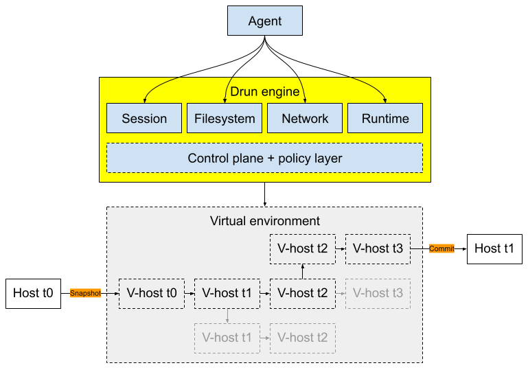

# drun (deterministic run)

<div align="center">



</div>

## Git for agents with ephemeral runtime

Drun is a platform that allows you to virtualize components of your host into an
ephemeral runtime to serve as the agent's workspace with git-like primitives
which allow the agent to explore trajectories in parallel and discard dead-ends
without disrupting the host state.

Drun surfaces a runtime abstration layer with reliability harnesses to guardrail
the agent's behavior across a range of OS-level aspects:

- Network domains (e.g. allowlisted domains)
- Command exeuction (e.g. forbidden commands)
- Access to filesystem paths (e.g. restrict filesystem access)
- Resource limits (e.g. memory and duration caps)

Rather than granting your agent raw CRUD access to your host, Drun exposes and
enforces a highly-customizable policy layer with deterministic knobs for you to
place absolute limits that can't be breached by design.

## Usage

### Installing

The following describes installation steps to integrate with Claude Code. There
are plans in the future to support other user journeys such as OpenAI, Ollama
and even a Python SDK as well as more programming languages. Consider this
document as the current source of truth of what's production-ready.

#### Requirements

- [Claude Code](https://code.claude.com/docs/en/quickstart#step-1-install-claude-code).

Open a terminal and go to your project folder.

```bash
cd ~/path/to/project
```

Run the installation script which does a few of things:

```bash
curl -fsSL https://raw.githubusercontent.com/dmosc/drun/main/install.sh | bash
```

1. Installs the drun MCP binary to `/usr/local/bin/drun-mcp` (skips if already
   installed):
1. Creates a config at `$PWD/.drun/config.toml` with common defaults.
1. Registers the MCP against `$PWD` inside your `~/.claude.json` so the config
   only applies to this specific project.

And ultimately, validate that the MCP is live with the following command (run
this from within the same `$PWD` where you ran the install script):

```bash
claude mcp list
```

#### Upgrading

Run the following commands to upgrade drun's MCP to the latest release:

```bash
# MCP binary
curl -fsSL https://raw.githubusercontent.com/dmosc/drun/main/update.sh | bash

# Update to a specific version
curl -fsSL https://raw.githubusercontent.com/dmosc/drun/main/update.sh | bash -s -- v0.1.1
```

#### Uninstalling

Run the following command to uninstall drun from your host:

```
curl -fsSL https://raw.githubusercontent.com/dmosc/drun/main/uninstall.sh | bash
```

1. Removes the drun MCP binary from `/usr/local/bin/drun-mcp`.
1. Leaves the created config `$PWD/.drun/config.toml` untouched for reference.
   You can safely delete this if not needed.
1. Unlinks the MCP reference from all Claude Code projects where it has been
   installed.

### Configuration

The behavior of the drun MCP is orchestrated via the `$PWD/.drun/config.toml`
configuration file. This file is read once at process startup; without it,
built-in defaults apply.

The following is a reference of all the controls available for tuning. All
fields are optional.

| Field                       | Default                                                      | Description                                                                                                                                                                                                                                                   |
| --------------------------- | ------------------------------------------------------------ | ------------------------------------------------------------------------------------------------------------------------------------------------------------------------------------------------------------------------------------------------------------- |
| `domain_allowlist`          | `[]`                                                         | Additional domains reachable via `session_fetch`. Use `["*"]` to allow all, or `"*.example.com"` for subdomains.                                                                                                                                              |
| `fetch_timeout_ms`          | `60000`                                                      | Timeout for the full `session_fetch` response in milliseconds.                                                                                                                                                                                                |
| `connect_timeout_ms`        | `30000`                                                      | TCP connection timeout for `session_fetch` in milliseconds.                                                                                                                                                                                                   |
| `bash_timeout_ms`           | `30000`                                                      | Maximum wall time for a single `session_bash` call.                                                                                                                                                                                                           |
| `max_workspace_mb`          | `512`                                                        | Maximum workspace size per session in megabytes. Checked before each new checkpoint is appended.                                                                                                                                                              |
| `max_sessions`              | `50`                                                         | Maximum number of concurrent sessions.                                                                                                                                                                                                                        |
| `max_checkpoints`           | `200`                                                        | Maximum checkpoints stored per session. When the limit is reached, squash or drop old checkpoints.                                                                                                                                                            |
| `session_idle_timeout_secs` | `3600`                                                       | Seconds of inactivity before a session is considered abandoned and rejected.                                                                                                                                                                                  |
| `mount_allowlist`           | `[]`                                                         | Host path prefixes that `session_mount` may read from. Empty means all paths are permitted. Non-empty restricts mounts to the listed prefixes.                                                                                                                |
| `mount_overlay_paths`       | `["node_modules", ".venv", "venv", "target", "__pycache__"]` | Directory names that `session_mount` registers as read-only host overlays instead of loading into the workspace. Overlay dirs are symlinked at execution time and never checkpointed. Python venvs are also injected into `sys.path`. Set to `[]` to disable. |
| `export_root`               | `"drun-export"`                                              | Directory that `session_export` must write into. Relative paths are resolved from the current working directory.                                                                                                                                              |
| `snapshots_dir`             | `"drun-snapshots"`                                           | Directory where `session_snapshot` writes `.drun` files.                                                                                                                                                                                                      |
| `snapshot_on_close`         | `false`                                                      | When `true`, automatically write a snapshot when `session_close` is called.                                                                                                                                                                                   |
| `env_allowlist`             | `[]`                                                         | Host environment variable names exposed to agents via `session_get_env`. Empty means no variables are exposed.                                                                                                                                                |
| `bash_command_denylist`     | `[]`                                                         | Command substrings always rejected by `session_bash` before execution.                                                                                                                                                                                        |
| `bash_command_allowlist`    | `[]`                                                         | Command substrings permitted by `session_bash`. Empty means all commands are allowed (subject to the denylist).                                                                                                                                               |

#### Reloading the MCP

`config.toml` is read once when the MCP process starts. Changes to the file take
effect only after the MCP server is restarted. How to trigger that depends on
your setup.

**Claude Code CLI**

Open a new `claude` session. Each invocation spawns a fresh MCP process that
reads `config.toml` on startup, so closing and re-opening the chat is
sufficient.

```bash
claude
```

**Claude Code in VSCode**

The VSCode extension keeps the MCP process running in the background across chat
sessions within the same window. To restart it after editing `config.toml`,
reload the VSCode window:

1. Open the Command Palette (`Cmd+Shift+P` on macOS / `Ctrl+Shift+P` on Windows
   and Linux).
2. Run **Developer: Reload Window**.

The extension restarts the MCP server on reload, picking up the updated
configuration.
