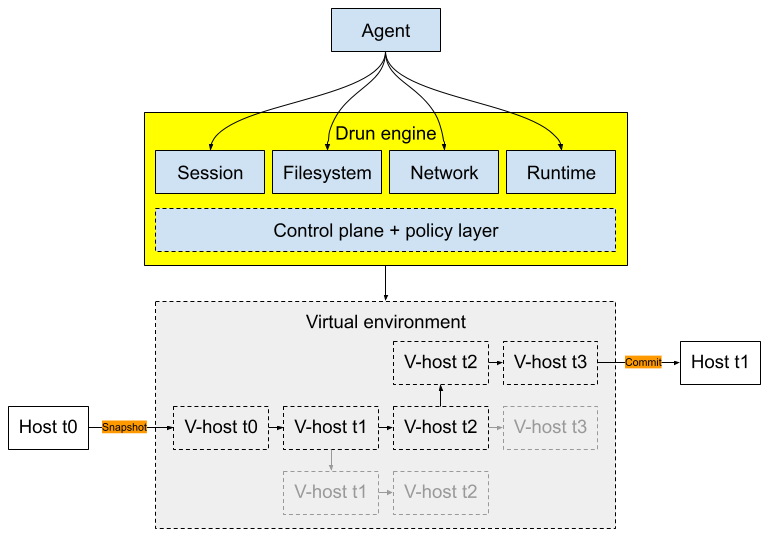

# drun (deterministic run)

<div align="center">


</div>

## Git for agents with ephemeral runtime

Drun is a platform that allows you to virtualize components of your host into an
ephemeral runtime to serve as the agent's workspace with git-like primitives
which allow the agent to explore trajectories in parallel and discard dead-ends
without disrupting the host state.

Drun surfaces a runtime abstraction layer with reliability harnesses to
guardrail the agent's behavior across a range of OS-level aspects:

- Network domains (e.g. allowlisted domains)
- Command execution (e.g. forbidden commands)
- Access to filesystem paths (e.g. restrict filesystem access)
- Resource limits (e.g. memory and duration caps)

Rather than granting your agent raw access to your host, Drun exposes and
enforces a highly-customizable policy layer with deterministic knobs for you to
place absolute limits that can't be breached by design.

<div align="center">



</div>

## Usage

The drun framework can be consumed in the following ways:

- **[Via Claude Code](#claude-code)**: drun's MCP tools replace Claude's native
  file/shell/network tools inside a sandboxed workspace.
- **[Via Gemini CLI](#gemini-cli)**: same idea, for
  [Gemini CLI](https://github.com/google-gemini/gemini-cli).
- **[Via Codex CLI](#codex-cli)**: same idea, for
  [OpenAI's Codex CLI](https://developers.openai.com/codex).
- **[Via Hermes](#hermes)**: same idea, for local models run through
  [Hermes](https://github.com/NousResearch/hermes-agent).
- **[Standalone CLI](#standalone-cli)**: a CLI agentic loop that's integrated
  with [Ollama](https://ollama.com/) and [LiteLLM](https://docs.litellm.ai/).
- **[Using the Python SDK](#python-sdk)**: script sandboxed sessions directly,
  no LLM or daemon required.

### Installing

All journeys except for the [Python SDK](#using-the-python-sdk) require the
`drun-mcp` daemon installed and running in the host machine to operate. This is
done once with:

```bash
curl -fsSL https://raw.githubusercontent.com/dmosc/drun/main/install.sh | bash
```

This installs and configures a few things (skips if not applicable):

1. The `drun-mcp` binary under `/usr/local/bin/drun-mcp`.
2. A global config at `~/.drun/config.toml` with sensible defaults.
3. `drun-mcp` as a persistent background daemon (`launchd` on macOS, `systemd`
   on Linux) so a single process serves all simultaneous sessions running on the
   host.

`install.sh` only handles the binary and the daemon — it does not wire up any
agent. Once it's done, point the binary at whichever bridge you use:

```bash
# Run from a project root — `claude`/`gemini` init are per-project scoped;
# `codex`/`hermes` init also register machine-wide, but still need a per-project
# run to drop their context file (AGENTS.md/HERMES.md) into this project.
drun-mcp claude init
drun-mcp gemini init
drun-mcp codex init
drun-mcp hermes init
```

`drun-mcp bridges list` shows every bridge drun currently supports (name, scope,
and what it does). `drun-mcp bridges deregister-all` undoes every bridge that's
currently registered in one call.

See [Claude Code](#claude-code), [Gemini CLI](#gemini-cli),
[Codex CLI](#codex-cli), and [Hermes](#hermes) for what each of these does.

Once installed, the following endpoints are available:

| Endpoint                    | Purpose                                          |
| --------------------------- | ------------------------------------------------ |
| `http://127.0.0.1:7273/sse` | MCP transport (SSE); used by Claude Code         |
| `http://127.0.0.1:7273/mcp` | MCP transport (streamable HTTP); used by the CLI |
| `http://127.0.0.1:7274`     | Web interface to manage sessions                 |

#### Upgrading

Run the following commands to upgrade drun's MCP to the latest release:

> The upgrade operation hard-reloads the daemon process, effectively dropping
> all in-memory objects, including ongoing sessions. Be sure to snapshot and
> close your sessions before updating.

```bash
# MCP binary
curl -fsSL https://raw.githubusercontent.com/dmosc/drun/main/update.sh | bash

# Update to a specific version
curl -fsSL https://raw.githubusercontent.com/dmosc/drun/main/update.sh | bash -s -- v0.3.16
```

#### Uninstalling

Run the following command to uninstall drun from your host:

```
curl -fsSL https://raw.githubusercontent.com/dmosc/drun/main/uninstall.sh | bash
```

1. Stops the background daemon and removes the `launchd` agent (macOS) or
   `systemd` user service (Linux).
1. Unlinks the MCP from any bridge it was wired to (e.g. Claude Code, Gemini
   CLI, Codex CLI, Hermes) — via `drun-mcp bridges deregister-all`, which knows
   every bridge drun supports without `uninstall.sh` having to name them.
1. Removes the drun MCP binary from `/usr/local/bin/drun-mcp`.
1. Removes `.claude/settings.json` and `.gemini/settings.json` from every
   project drun was initialized in, so native tools are restored automatically.
1. Leaves `~/.drun/config.toml` and any per-project context files (`CLAUDE.md`,
   `GEMINI.md`, `AGENTS.md`, `HERMES.md`) untouched; delete these manually if
   not needed.

### Claude Code

#### Requirements

- [Claude Code](https://code.claude.com/docs/en/quickstart#step-1-install-claude-code).
- The `drun-mcp` daemon [installed](#global-install-once-per-machine) above.

#### Per-project setup

From the root of any project you want drun to manage:

```bash
drun-mcp claude init
```

This does two things:

1. **Registers drun with Claude Code**
   (`claude mcp add --scope user --transport
   sse drun http://127.0.0.1:7273/sse`)
   — a one-time, user-scope step; skipped if already registered. If the `claude`
   CLI isn't on `PATH`, it prints this command instead so you can run it
   yourself once Claude Code is installed.
2. **Creates two files in the current directory** (appends if they already
   exist):
   - `.claude/settings.json` — restricts Claude to drun tools only for this
     workspace. Native file (`Read`, `Edit`, `Write`, `NotebookEdit`, `Glob`,
     `Grep`), shell (`Bash`, `BashOutput`, `KillBash`), network (`WebFetch`,
     `WebSearch`), and subagent delegation (`Task`) tools are all blocked, and
     drun's MCP tools are pre-allowed so Claude isn't prompted on every call.
   - `CLAUDE.md` — instructs Claude how to use drun.

The tool restriction is intentionally per-project; you wouldn't want native
tools blocked globally across every workspace. Run `drun-mcp claude init` from
any project root to opt that project into the drun sandbox — the registration
step is idempotent, so re-running it across projects doesn't re-register with
Claude Code each time.

Validate that the MCP is live:

```bash
claude mcp list
```

To undo the global registration (leaving any per-project `.claude/settings.json`
and `CLAUDE.md` files in place — remove those by hand if you no longer want
them):

```bash
drun-mcp claude deregister
```

### Gemini CLI

#### Requirements

- [Gemini CLI](https://github.com/google-gemini/gemini-cli).
- The `drun-mcp` daemon [installed](#installing) above.

#### Per-project setup

From the root of any project you want drun to manage:

```bash
drun-mcp gemini init
```

This does two things:

1. **Registers drun with Gemini CLI**
   (`gemini mcp add --scope user --transport sse drun http://127.0.0.1:7273/sse`)
   — a one-time, user-scope step; skipped if already registered. If the `gemini`
   CLI isn't on `PATH`, it prints this command instead so you can run it
   yourself once Gemini CLI is installed.
2. **Creates two files in the current directory** (appends/skips if they already
   exist):
   - `.gemini/settings.json` — excludes drun-overlapping native tools
     (`ShellTool`, `EditTool`, `WriteFileTool`, `ReadFileTool`, `GlobTool`,
     `GrepTool`, `ReadManyFilesTool`, `LSTool`, `WebFetchTool`, `WebSearchTool`)
     via `excludeTools`, for this workspace only.
   - `GEMINI.md` - instructs Gemini how to use drun tools.

Same as Claude Code, the tool restriction is per-project and the registration
step is idempotent — re-running `drun-mcp gemini init` across projects doesn't
re-register with Gemini CLI each time.

To undo the global registration (leaving any per-project `.gemini/settings.json`
and `GEMINI.md` files in place):

```bash
drun-mcp gemini deregister
```

### Codex CLI

#### Requirements

- [Codex CLI](https://developers.openai.com/codex).
- The `drun-mcp` daemon [installed](#installing) above.

#### Setup

Run this from the root of any project you want drun to manage:

```bash
drun-mcp codex init
```

This does three things, all directly editing `~/.codex/config.toml` (a
structural TOML merge via [`toml_edit`](https://docs.rs/toml_edit), so any
comments or formatting you already have there survive untouched):

1. **Creates `AGENTS.md` in the current directory** (skipped if it already
   exists) — Codex's own auto-discovered context file, same role `CLAUDE.md`
   plays for Claude Code.
2. **Registers drun** under `[mcp_servers.drun]`, pointing at the daemon's
   streamable-HTTP endpoint:

   ```toml
   [mcp_servers.drun]
   url = "http://127.0.0.1:7273/mcp"
   ```

3. **Disables Codex's native shell tool** (`features.shell_tool = false`) so
   Codex relies on drun's sandboxed `session_bash` instead of running commands
   directly on the host. Because `config.toml` isn't project-scoped, this
   applies to **every** Codex session on the machine, not just projects using
   drun.

No CLI availability check is needed here (unlike Claude Code, Gemini CLI, or
Hermes) — this is a plain file edit, so it works whether or not the `codex`
binary is on `PATH` yet.

Steps 2 and 3 are machine-wide and idempotent — re-running `drun-mcp codex init`
in a second project skips them and only step 1 (`AGENTS.md`) does anything new.

To undo everything `codex init` did (deregisters drun and re-enables the shell
tool; leaves any project's `AGENTS.md` in place):

```bash
drun-mcp codex deregister
```

### Hermes

#### Requirements

- [Hermes](https://github.com/NousResearch/hermes-agent) running local models.
- The `drun-mcp` daemon [installed](#installing) above.

#### Setup

Run this from the root of any project you want drun to manage — same as
`drun-mcp claude init` for Claude Code:

```bash
drun-mcp hermes init
```

This does three things:

1. **Creates `HERMES.md` in the current directory** which instructs Hermes how
   to rely no drun.
2. **Registers drun** by writing a `drun` entry directly into
   `~/.hermes/config.yaml` under `mcp_servers`, pointing at the daemon's
   streamable-HTTP endpoint:

   ```yaml
   mcp_servers:
      drun:
         url: "http://127.0.0.1:7273/mcp"
         headers:
            Accept: "application/json, text/event-stream"
   ```

   If the `hermes` CLI isn't on `PATH` yet, it prints this block instead so you
   can add it manually once Hermes is set up.

3. **Disables Hermes's native `terminal`, `file`, `web`, `search`, and
   `delegation` toolsets** (via `agent.disabled_toolsets` in the same file) so
   Hermes relies on drun's sandboxed tools instead of touching the host
   directly. Because this key isn't project-scoped, it applies to **every**
   Hermes session on the machine, not just projects using drun — if you want
   Hermes to keep native tool access for other work, skip this step and edit
   `~/.hermes/config.yaml` by hand to register just the `mcp_servers` entry.

Steps 2 and 3 are machine-wide and idempotent — re-running
`drun-mcp hermes
init` in a second project skips them (already
registered/already disabled) and only step 1 (`HERMES.md`) actually does
anything new.

Start Hermes and it will discover drun's tools at connect time:

```bash
hermes chat
```

To undo everything `hermes init` did (deregisters drun and re-enables the
disabled toolsets machine-wide; leaves any project's `HERMES.md` in place — same
as Claude Code leaves `CLAUDE.md`, delete it by hand if you no longer want it):

```bash
drun-mcp hermes deregister
```

### Standalone CLI

`drun chat` drives an LLM — local via [Ollama](https://ollama.com) or any cloud
model supported by [LiteLLM](https://docs.litellm.ai/docs/providers) — against a
sandboxed session.

#### Requirements

- Python 3.9+.
- The `drun-mcp` daemon [installed](#global-install-once-per-machine) above.
- [Ollama](https://ollama.com) for local models, or an API key for a cloud
  model.

```bash
pip install 'drun-sandbox[chat]'
```

For a local model, install Ollama and pull a tool-calling-capable model:

```bash
ollama pull qwen2.5:14b
```

Then run:

```bash
drun chat "your prompt" --mount ./my-project
```

`--model` defaults to `ollama_chat/qwen2.5:14b`. To use a cloud model instead,
pass `--model` and set the provider's API key:

```bash
ANTHROPIC_API_KEY=... drun chat "your prompt" --model claude-sonnet-4-6
```

Each `drun chat` call creates a new session by default. Pass `--session-id` to
attach to one that's already running instead:

```bash
drun chat "keep going on the report in results.md" --session-id <id>
```

Run `drun chat --help` for all flags.

### Python SDK

Useful to spin up drun sessions programatically.

#### Requirements

- Python 3.9+.

```bash
pip install drun-sandbox
```

```python
from drun import Session

session = Session()
session.write_file("hello.py", b"print('hi')")
checkpoint = session.execute_bash("python3 hello.py")
print(checkpoint.stdout)
```

See [`examples/quickstart.py`](examples/quickstart.py) for a fuller walkthrough
(bash execution, write, diff, rollback, export).

### Configuration

The behavior of the drun MCP is orchestrated via `~/.drun/config.toml`, a single
global file shared by the background daemon. It's re-read on every tool call;
without it, built-in defaults apply.

The following is a reference of all the controls available for tuning. All
fields are optional.

| Field                        | Default                                                              | Description                                                                                                                                                                                                                                                                |
| ---------------------------- | -------------------------------------------------------------------- | -------------------------------------------------------------------------------------------------------------------------------------------------------------------------------------------------------------------------------------------------------------------------- |
| `domain_allowlist`           | `["pypi.org", "files.pythonhosted.org", "cdn.jsdelivr.net"]`         | Domains reachable via `session_fetch`. Defaults to the three built-ins if the key is absent; setting it explicitly (including `[]`) replaces the defaults outright, so an operator can restrict below them. Use `["*"]` to allow all, or `"*.example.com"` for subdomains. |
| `fetch_timeout_ms`           | `60000`                                                              | Timeout for the full `session_fetch` response in milliseconds.                                                                                                                                                                                                             |
| `connect_timeout_ms`         | `30000`                                                              | TCP connection timeout for `session_fetch` in milliseconds.                                                                                                                                                                                                                |
| `bash_timeout_ms`            | `30000`                                                              | Maximum wall time for a single `session_bash` call.                                                                                                                                                                                                                        |
| `package_install_enabled`    | `false`                                                              | Enables `session_package_install`. Disabled by default because, unlike `session_bash`, its sandbox has network access (confined to a disposable staging directory, never the session workspace).                                                                           |
| `package_install_timeout_ms` | `180000`                                                             | Maximum wall time for a single `session_package_install` call.                                                                                                                                                                                                             |
| `max_workspace_mb`           | `512`                                                                | Maximum workspace size per session in megabytes. Checked before each new checkpoint is appended.                                                                                                                                                                           |
| `max_sessions`               | `50`                                                                 | Maximum number of concurrent sessions.                                                                                                                                                                                                                                     |
| `max_checkpoints`            | `200`                                                                | Maximum checkpoints stored per session. When the limit is reached, squash or drop old checkpoints.                                                                                                                                                                         |
| `session_idle_timeout_secs`  | `3600`                                                               | Seconds of inactivity before a session is considered abandoned and rejected.                                                                                                                                                                                               |
| `mount_allowlist`            | `[]`                                                                 | Host path prefixes that `session_mount` may read from, and `session_export`/`delete_from_host` may write to or delete. Empty means all paths are permitted.                                                                                                                |
| `mount_overlay_paths`        | `["node_modules", ".venv", "venv", "target", "__pycache__", ".git"]` | Directory names that `session_mount` registers as read-only host overlays instead of loading into the workspace. Overlay dirs are symlinked at execution time and never checkpointed. Set to `[]` to disable.                                                              |
| `snapshots_dir`              | `"drun-snapshots"`                                                   | Directory where `session_snapshot` writes `.drun` files.                                                                                                                                                                                                                   |
| `snapshot_on_close`          | `false`                                                              | When `true`, automatically write a snapshot when `session_close` is called.                                                                                                                                                                                                |
| `env_allowlist`              | `[]`                                                                 | Host environment variable names exposed to agents via `session_get_env`. Empty means no variables are exposed.                                                                                                                                                             |
| `bash_command_denylist`      | `[]`                                                                 | Command substrings always rejected by `session_bash` before execution.                                                                                                                                                                                                     |
| `bash_command_allowlist`     | `[]`                                                                 | Command substrings permitted by `session_bash`. Empty means all commands are allowed (subject to the denylist).                                                                                                                                                            |
| `web_port`                   | `7274`                                                               | TCP port for the trajectory viewer web UI. Set to `0`, or remove the field from the config file, to disable it.                                                                                                                                                            |

#### Updating configuration via the CLI

A couple of utility commands to update the configuration via the `drun-mcp` CLI
are available:

```bash
drun-mcp config add-domain example.com
drun-mcp config add-path /path/to/allow
drun-mcp config remove-domain example.com
drun-mcp config remove-path /path/to/allow
# To validate latest changes to config.
drun-mcp config list
```

Run `drun-mcp config --help` to print a list of available commands.

`~/.drun/config.toml` is re-read on every tool call, so edits — via the CLI
above or by hand — take effect on the very next call, no restart, no dropped
sessions. `drun-mcp claude init` also allowlists the current project directory
for `session_mount` automatically.

The exceptions are `web_port`, `session_idle_timeout_secs`: these are only
applied at daemon startup, so changing any of them still requires a restart:

**macOS**

```bash
launchctl unload ~/Library/LaunchAgents/com.drun.mcp-server.plist
launchctl load -w ~/Library/LaunchAgents/com.drun.mcp-server.plist
```

**Linux**

```bash
systemctl --user restart drun-mcp.service
```

#### Verifying the daemon is healthy

A dead or crash-looping daemon can look identical to an idle one from the
outside. See
[docs/troubleshooting.md's Health check section](docs/troubleshooting.md#health-check--is-drun-actually-running)
for commands to confirm it's running exactly once, actually listening, and not
stuck being killed and retried by launchd/systemd.

### Manage drun remotely

We recommend setting up [Tailscale](https://tailscale.com/) across your devices
to remotely manage drun. Roughly the steps are as follows:

1. Install drun and make sure that the web service is up by visiting
   `http://127.0.0.1:7274`.
1. Download Tailscale on the different devices you want to connect (e.g.
   computer and phone).
1. Boot up a Tailscale server pointing at the drun webserver with:

   ```bash
   tailscale serve --bg --https=443 http://127.0.0.1:7274
   ```
1. If the command succeeds, your web server UI should be accessible at the
   domain printed in the console by Tailscale.

### Chat from the web UI

Each session card has a **Chat** button — send it a prompt and the daemon runs
`drun chat` against that exact session, so the agent gets the daemon's full
sandboxed tool suite (`session_bash`, `session_fetch`, ...) under the same
guardrails as any other bridge. Handy paired with
[remote management](#manage-drun-remotely): drive a session from your phone
without a terminal.

Requires the [standalone CLI](#standalone-cli) installed on the same machine as
the daemon:

```bash
pip install 'drun-sandbox[chat]'
```

The card's status pill shows "Running" while the agent works; refresh the
session's checkpoint list to see what it did.
